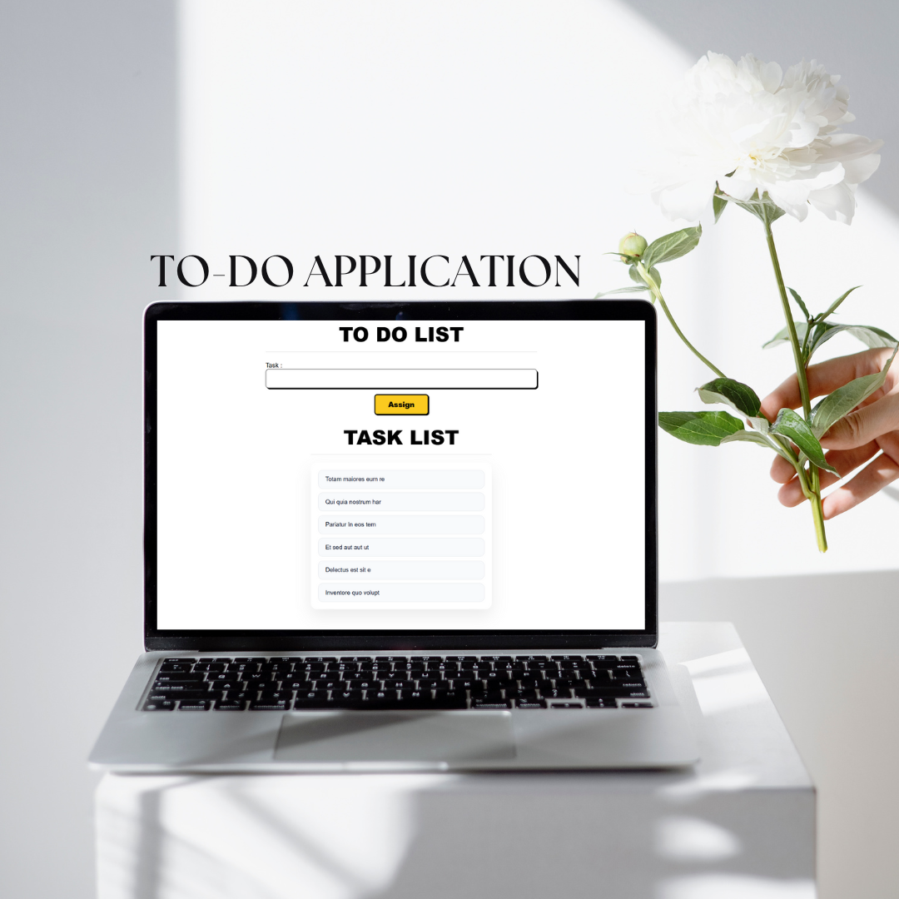

# 🚀 React 3 Project (Vite)

A modern **React + Vite** project built to practice **core React concepts** like **events, hooks, refs, and state management**, with clean UI and real examples.

🔗 **Live Demo:**
👉 [https://your-live-link-here.vercel.app](https://your-live-link-here.vercel.app)
*(replace with Netlify / Vercel link)*



---

## ✨ Features

* ⚡ Fast setup using **Vite**
* 🧠 Core React concepts with real examples
* 🎯 Clean & modern UI
* 📦 Component-based structure
* 💡 Beginner-friendly & interview-ready

---

## 📂 Components Overview

### 📝 ToDoList Component

A simple and clean **Todo application** using **uncontrolled inputs (`useRef`)**.

**What it demonstrates:**

* `useState` for task list
* `useRef` for input handling
* Form submission handling
* Dynamic list rendering
* Clean UI for task display

**Key Concepts Used:**

* `useState`
* `useRef`
* Event handling (`onSubmit`)
* List rendering with `.map()`

---

### 🎯 Events Component

A hands-on demo of **React event handling** with visual feedback.

**Events Covered:**

1. **onClick** – Show / Hide text
2. **onClick (Toggle)** – Toggle visibility
3. **onChange & onFocus** – Live input update
4. **onMouseEnter & onMouseLeave** – Hover effects

**Key Concepts Used:**

* `useState`
* `useRef`
* DOM manipulation via refs
* Inline styling for event effects

---

## 🛠️ Tech Stack

* ⚛️ React
* ⚡ Vite
* 🎨 CSS
* 🧠 JavaScript (ES6+)

---

## ▶️ Getting Started

### 1️⃣ Clone the Repository

```bash
git clone https://github.com/your-username/react-vite-practice.git
```

### 2️⃣ Install Dependencies

```bash
npm install
```

### 3️⃣ Run Development Server

```bash
npm run dev
```

Open 👉 `http://localhost:5173` in your browser.

---

## 📸 Screenshots

> UI preview of Todo List & Events handling


---

## 📚 What You’ll Learn From This Project

* Difference between **controlled & uncontrolled components**
* How React handles **events**
* Using **refs instead of state**
* Building clean UI with simple CSS
* Structuring React projects properly

---

## 🌟 Future Improvements

* ✅ Delete & edit todo tasks
* 🌗 Dark / light theme toggle
* 🔔 Toast notifications
* 📱 Better mobile responsiveness
* 🎞️ Animations using GSAP / Framer Motion

---

## 👨‍💻 Author

**Saiyed Anashali**
Learning React step by step 🚀

📌 *If you like this project, don’t forget to ⭐ the repo!*

